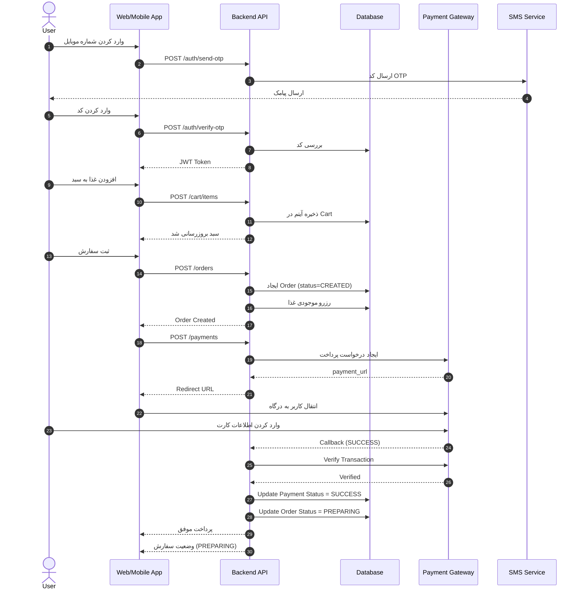

# 📘 سند مشخصات فنی نرم‌افزار (SRS)

## پلتفرم آنلاین سفارش غذا

**تمرکز: Backend و API**

---

## 1️⃣ مقدمه

### 1.1 هدف سند

این سند مشخصات فنی کامل بخش بک‌اند و API پلتفرم سفارش غذا را بر اساس PRD ارائه می‌دهد. تمرکز صرفاً بر معماری، APIها، مدل داده، امنیت، عملکرد و یکپارچگی سیستم است.

### 1.2 محدوده سیستم

سیستم شامل:

* API عمومی برای اپ و وب
* پنل رستوران (API اختصاصی)
* سیستم مدیریت سفارش
* پرداخت آنلاین
* OTP
* مدیریت وضعیت سفارش
* سیستم امتیازدهی (Phase 2)

---

# 2️⃣ معماری سیستم (System Architecture)




---


## 2.1 سبک معماری

* RESTful API
* معماری Modular Monolith (در MVP)
* قابلیت ارتقا به Microservices در فاز رشد

## 2.2 اجزای اصلی

```
Client (Web / Mobile)
        ↓
API Gateway
        ↓
Application Layer
        ↓
Domain Layer
        ↓
Database
        ↓
External Services (SMS, Payment)
```

---

# 3️⃣ طراحی API

## 3.1 استانداردهای کلی

* Base URL:

```
/api/v1/
```

* فرمت پاسخ: JSON
* احراز هویت: JWT
* Versioning در URL
* HTTP Status Codes استاندارد

---

# 4️⃣ ماژول احراز هویت (Authentication)

## 4.1 ارسال OTP

### `POST /auth/send-otp`

**Request**

```json
{
  "mobile": "09123456789"
}
```

**Response**

```json
{
  "success": true,
  "expires_in": 120
}
```

---

## 4.2 تایید OTP و ورود

### `POST /auth/verify-otp`

```json
{
  "mobile": "09123456789",
  "code": "1234"
}
```

**Response**

```json
{
  "access_token": "jwt-token",
  "refresh_token": "refresh-token",
  "user": {...}
}
```

---

## 4.3 الزامات امنیتی

* OTP منقضی شود (۲ دقیقه)
* Rate limit برای ارسال OTP
* بلاک موقت بعد از 5 تلاش ناموفق

---

# 5️⃣ مدیریت کاربران

## 5.1 دریافت پروفایل

`GET /users/me`

## 5.2 ثبت آدرس

`POST /users/addresses`

## 5.3 دریافت لیست آدرس‌ها

`GET /users/addresses`

---

# 6️⃣ مدیریت رستوران‌ها

## 6.1 دریافت لیست رستوران‌ها

`GET /restaurants`

### Query Params:

* search
* category
* lat
* lng
* sort (price, rating, delivery_time)

---

## 6.2 دریافت جزئیات رستوران

`GET /restaurants/{id}`

---

# 7️⃣ مدیریت منو

## 7.1 دریافت منو

`GET /restaurants/{id}/menu`

ساختار:

```json
[
  {
    "category": "پیتزا",
    "items": [...]
  }
]
```

---

# 8️⃣ سبد خرید (Cart)

> سبد خرید سمت سرور نگهداری می‌شود

## 8.1 افزودن آیتم

`POST /cart/items`

## 8.2 حذف آیتم

`DELETE /cart/items/{id}`

## 8.3 مشاهده سبد

`GET /cart`

---

# 9️⃣ سفارش (Orders)

## 9.1 ثبت سفارش

`POST /orders`

```json
{
  "address_id": 1,
  "payment_method": "online",
  "delivery_time": "now"
}
```

---

## 9.2 دریافت سفارش‌های کاربر

`GET /orders`

---

## 9.3 دریافت جزئیات سفارش

`GET /orders/{id}`

---

## 9.4 وضعیت‌های سفارش

```
CREATED
PREPARING
READY
ON_THE_WAY
DELIVERED
CANCELLED
```

---

# 🔟 پرداخت (Payments)

## 10.1 ایجاد پرداخت

`POST /payments`

Response:

```json
{
  "payment_url": "https://gateway.com/redirect"
}
```

---

## 10.2 Callback درگاه

`POST /payments/callback`

---

## 10.3 وضعیت پرداخت

```
PENDING
SUCCESS
FAILED
REFUNDED
```

---

# 1️⃣1️⃣ پیگیری سفارش (Tracking)

## 11.1 دریافت وضعیت لحظه‌ای

`GET /orders/{id}/tracking`

در صورت استفاده از WebSocket:

```
/ws/orders/{id}
```

---

# 1️⃣2️⃣ سیستم امتیازدهی (Phase 2)

## 12.1 ثبت نظر

`POST /reviews`

## 12.2 دریافت نظرات رستوران

`GET /restaurants/{id}/reviews`

---

# 1️⃣3️⃣ مدل داده (Database Schema)

## جداول اصلی

### Users

* id
* mobile
* created_at

### Addresses

* id
* user_id
* lat
* lng
* details

### Restaurants

* id
* name
* lat
* lng
* rating
* min_order

### MenuItems

* id
* restaurant_id
* price
* stock
* is_available

### Orders

* id
* user_id
* restaurant_id
* total_price
* status

### OrderItems

* id
* order_id
* menu_item_id
* quantity
* price

### Payments

* id
* order_id
* status
* ref_id

### Reviews

* id
* order_id
* rating
* comment

---

# 1️⃣4️⃣ قوانین تجاری (Business Rules)

* کاربر فقط می‌تواند از یک رستوران در هر سفارش خرید کند
* حداقل سفارش رعایت شود
* لغو فقط تا قبل از PREPARING
* اگر پرداخت آنلاین Fail شود → سفارش CANCELLED شود
* موجودی هنگام ثبت سفارش رزرو شود

---

# 1️⃣5️⃣ Non-Functional Requirements

## 15.1 Performance

* پاسخ API زیر 300ms
* توانایی 1000 سفارش همزمان (MVP)

## 15.2 Scalability

* Stateless API
* استفاده از Redis برای:

  * Cache
  * Rate limit
  * Session

## 15.3 Security

* JWT + Refresh Token
* HTTPS اجباری
* Hash رمزها (اگر در آینده اضافه شد)
* جلوگیری از SQL Injection
* Validation کامل ورودی‌ها

## 15.4 Logging & Monitoring

* Log خطاها
* Audit Log برای پرداخت
* مانیتورینگ با Prometheus + Grafana

---

# 1️⃣6️⃣ یکپارچگی با سرویس‌های خارجی

## 16.1 سیستم پیامک OTP

* ارسال
* مدیریت timeout
* Failover provider

## 16.2 درگاه پرداخت

جریان:

```
Create Order
    ↓
Create Payment
    ↓
Redirect to Gateway
    ↓
Callback
    ↓
Verify Payment
    ↓
Update Order Status
```

---

# 1️⃣7️⃣ مدیریت خطا

فرمت استاندارد:

```json
{
  "error": {
    "code": "INVALID_PAYMENT",
    "message": "پرداخت ناموفق بود"
  }
}
```

---

# 1️⃣8️⃣ Rate Limiting

* OTP: هر شماره 3 بار در 10 دقیقه
* Login: 5 بار تلاش ناموفق
* API عمومی: 100 درخواست در دقیقه

---

# 1️⃣9️⃣ Roadmap فنی Backend

### فاز 1 (MVP)

* Auth
* Restaurants
* Cart
* Orders
* Payments
* Tracking ساده

### فاز 2

* Reviews
* Discounts
* Wallet
* Recommendation Engine

---

# 2️⃣0️⃣ پیشنهاد تکنولوژی

* Node.js (NestJS) یا Laravel
* PostgreSQL
* Redis
* Docker
* Nginx
* CI/CD Pipeline

---

# ✅ جمع‌بندی

این سند SRS تمرکز کامل بر:

* طراحی API
* قوانین تجاری
* مدل داده
* امنیت
* عملکرد
* مقیاس‌پذیری

دارد و آماده تبدیل به تسک‌های توسعه برای تیم بک‌اند است.

---

اگر بخواهی می‌توانم در مرحله بعد:

* 📊 ERD حرفه‌ای طراحی کنم
* 📦 ساختار فولدر پروژه NestJS بدهم
* 🧩 Swagger کامل API تولید کنم
* 🧠 طراحی معماری Microservice نسخه مقیاس‌پذیر را آماده کنم

کدام را نیاز داری؟
